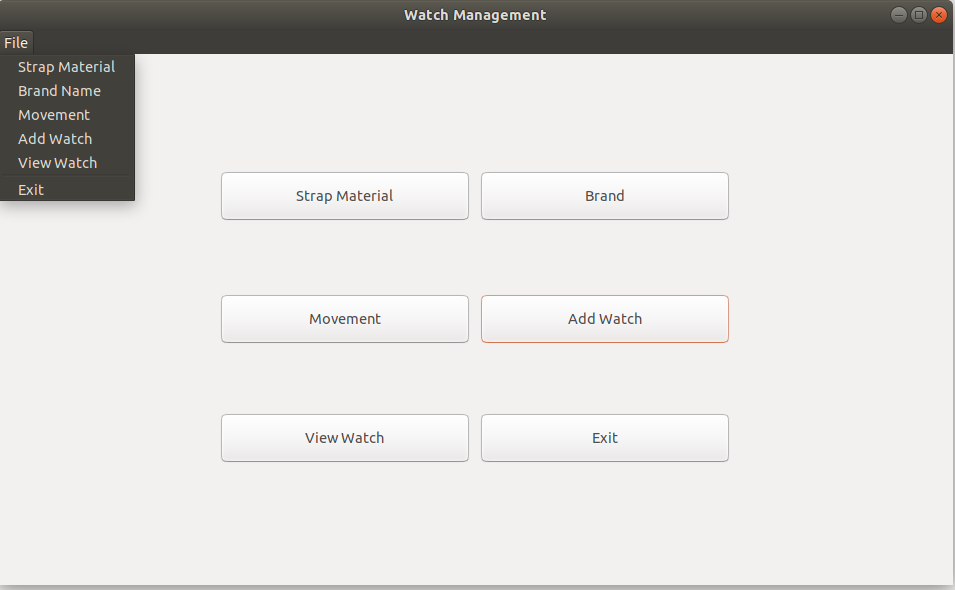
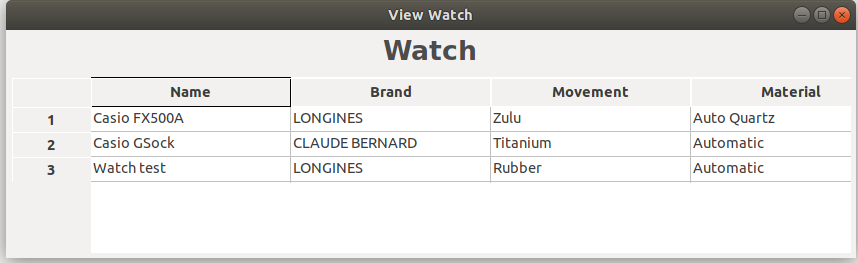
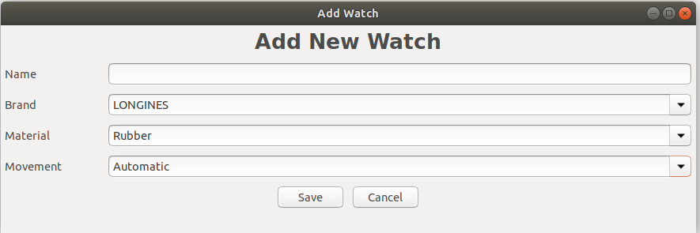
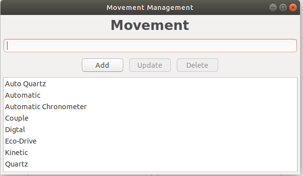
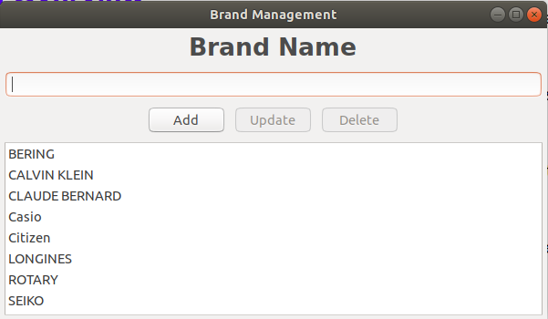
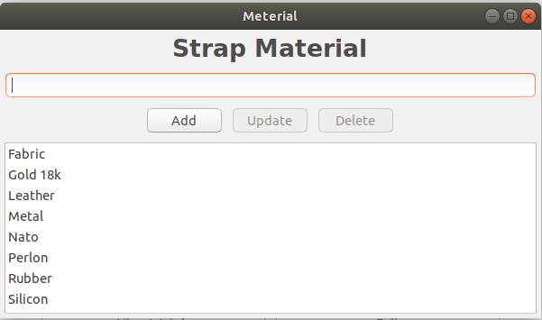

# 1. Introduction
The purpose of this app is used for management watch. We have five components on this app, they are **Brand**, **Movement**, **Strap Material**, **Add Watch** and **View All Watch**. This app uses SQL Lite database at **data/db_Watch**.
We have build a version for Ubuntu 18.04 and Window 7.
* For Ubuntu enviroment, run file: **Watch_Ubuntu**
* For Window7 enviroment, run file: **Watch_Window7.exe**

# 2. Application Overview
The first screen when you run app is home page. This screen show all buttons, each button is a feature of app. User can access these feature via menu File.

Click on View Watch button, the app will show all available watches in current system.

Click on Add Watch button. A form will be shown and let user input new watch into system.

Click on Movement button. A form will be shown and let user input the watch type(movement).

Click on Brand button. A form will be shown and let user input the watch brand name: Casio, Citizen, Seiko,...

Click on Strap Material button, A material form is shown and let user input raw material for making watch

